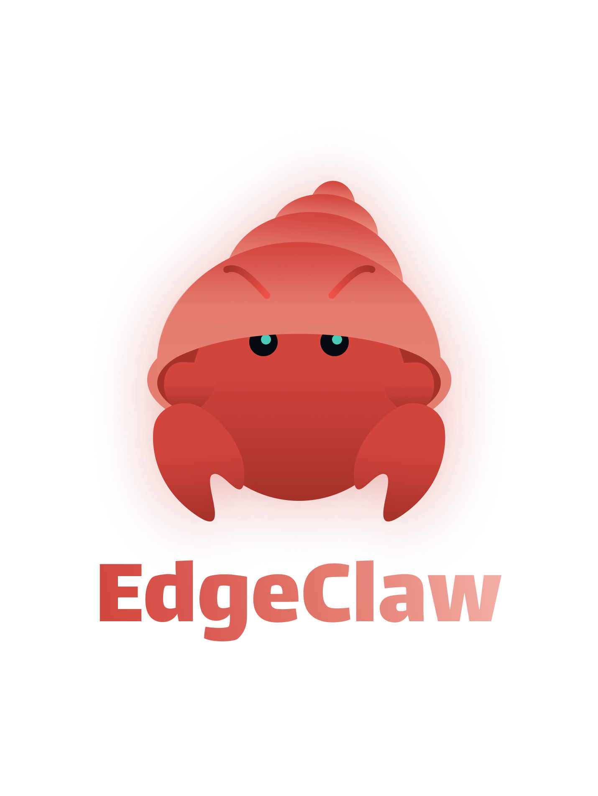
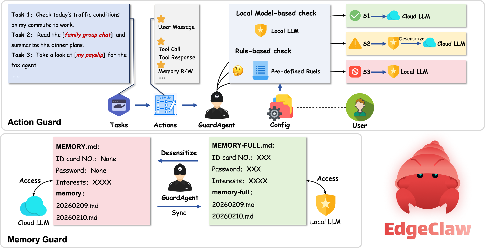

<div align="center">
  </img>
</div>

<h3 align="center">
EdgeClaw: Edge-Cloud Collaborative Personal AI Assistant based on OpenClaw
</h3>

<p align="center">
    【<a href="./readme_zh.md"><b>中文</b></a> | English】
</p>

## News

- [2026-02-12] 🚀🚀🚀 We open-source EdgeClaw, an edge-cloud collaborative AI assistant based on OpenClaw

## Overview

EdgeClaw is an edge-cloud collaborative personal AI assistant, jointly developed by [THUNLP](https://nlp.csai.tsinghua.edu.cn), [Renmin University of China](http://ai.ruc.edu.cn/), [AI9Stars](https://github.com/AI9Stars), [ModelBest](https://modelbest.cn/en) and [OpenBMB](https://www.openbmb.cn/home), built on top of [OpenClaw](https://github.com/openclaw/openclaw).[1]

Designed to tackle the AI Agent data leakage challenge, EdgeClaw provides a comprehensive, customizable three-tier security system (S1 passthrough / S2 desensitization / S3 local). It standardizes safety guardrails into a universal GuardAgent Protocol (Hooker → Detector → Action). Combined with intelligent edge-cloud routing capabilities, developers can achieve seamless privacy protection — "public data to the cloud, private data stays local" — within OpenClaw without modifying any business logic, balancing the peak performance of large models with absolute security of sensitive data.

[1] OpenClaw：https://github.com/openclaw/openclaw

<div align="center">
  </img>
</div>

## Demo

<!-- <div align="center">
  <a href="https://www.bilibili.com/video/BV1DYkLBNE6f"></a>
</div> -->

## Installation

Same as OpenClaw:

### 1. Clone the Repository

```bash
git clone https://github.com/openbmb/openclaw.git
cd openclaw
```

### 2. Install Dependencies + Build

```bash
pnpm install
pnpm build
pnpm ui:build
pnpm openclaw --install-daemon
```

### 3. Install the Extension

GuardClaw is included in the `extensions/guardclaw` directory. Enable it in your `openclaw.json` configuration:

```json

{
  "plugins": {
    "entries": {
      "guardclaw": {
        "enabled": true,
        "config": {
          "privacy": {...}
        }
      }
    }
  }
}
```

### 4. Configure Guard

Edit the `privacy` field under `plugins.entries.guardclaw.config` in `openclaw.json` (see the [Customization](#customization) section below for full details):

```json
{
  "privacy": {
    "enabled": true,
    "localModel": {
      "enabled": true,
      "provider": "ollama",
      "model": "openbmb/minicpm4.1",
      "endpoint": "http://localhost:11434"
    },
    "guardAgent": {
      "id": "guard",
      "workspace": "~/.openclaw/workspace-guard",
      "model": "ollama/openbmb/minicpm4.1"
    }
  }
}
```

Also, add a `list` field under the `agents` section in `openclaw.json`:

```json
"list": [
  {
    "id": "main",
    "workspace": "~/.openclaw/workspace-main",
    "subagents": {
      "allowAgents": ["guard"]
    }
  },
  {
    "id": "guard",
    "workspace": "~/.openclaw/workspace-guard",
    "model": "ollama/openbmb/minicpm4.1"
  }
]
```

5. Start Ollama

```bash
# Install Ollama (if not already installed)
# macOS: brew install ollama
# Linux: curl -fsSL https://ollama.ai/install.sh | sh

# Pull the model
ollama pull openbmb/minicpm4.1

# Start the service (default port 11434)
ollama serve
```

Then start OpenClaw as usual:

```bash
pnpm openclaw gateway run
```

GuardClaw will automatically intercept and route sensitive requests.

## Customization

GuardClaw supports custom configuration, rules, and more:

### JSON Configuration — Rules & Models

Edit the `privacy` field under `plugins.entries.guardclaw.config` in `openclaw.json`:

### Custom Detection Rules

```json
{
  "privacy": {
    "rules": {
      "keywords": {
        "S2": ["password", "api_key", "token", "credential"],
        "S3": ["ssh", "id_rsa", "private_key", ".pem", "master_password"]
      },
      "patterns": {
        "S2": [
          "\\b(?:10|172\\.(?:1[6-9]|2\\d|3[01])|192\\.168)\\.\\d{1,3}\\.\\d{1,3}\\b",
          "(?:mysql|postgres|mongodb)://[^\\s]+"
        ],
        "S3": ["-----BEGIN (?:RSA |EC )?PRIVATE KEY-----", "AKIA[0-9A-Z]{16}"]
      },
      "tools": {
        "S2": {
          "tools": ["exec", "shell"],
          "paths": ["~/secrets", "~/private"]
        },
        "S3": {
          "tools": ["system.run", "sudo"],
          "paths": ["~/.ssh", "/etc", "~/.aws", "/root"]
        }
      }
    }
  }
}
```

### Custom Checkpoints & Detector Types

Control which detectors run at which stage:

```json
{
  "privacy": {
    "checkpoints": {
      "onUserMessage": ["ruleDetector", "localModelDetector"],
      "onToolCallProposed": ["ruleDetector"],
      "onToolCallExecuted": ["ruleDetector"]
    }
  }
}
```

- `ruleDetector` — Fast rule-based detection
- `localModelDetector` — LLM-based semantic understanding (~1–2s), recommended for `onUserMessage`

### Custom Models

```json
{
  "privacy": {
    "localModel": {
      "enabled": true,
      "provider": "ollama",
      "model": "openbmb/minicpm4.1",
      "endpoint": "http://localhost:11434"
    },
    "guardAgent": {
      "id": "guard",
      "workspace": "~/.openclaw/workspace-guard",
      "model": "ollama/openbmb/minicpm4.1"
    }
  }
}
```

Any Ollama-compatible model is supported. Models with 8B+ parameters are recommended for classification accuracy.

### Custom Markdown Prompts — Classification & Behavior

Three Markdown files in the `prompts/` directory can be edited directly to change GuardClaw's behavior:

#### `prompts/detection-system.md` — Classification Rules

Controls how the LLM classifies S1/S2/S3. You can:

- Adjust classification criteria for each level
- Add specific sensitive data types
- Modify edge-case decision rules

#### `prompts/guard-agent-system.md` — Guard Agent Behavior

Controls how the S3 local model responds. You can:

- Adjust response style and verbosity
- Add domain-specific analysis instructions
- Modify language rules
- Integrate with the original OpenClaw system prompt, etc.

#### `prompts/pii-extraction.md` — Sensitive Information Extraction Rules

Controls which sensitive information types are extracted during S2 desensitization. You can:

- Add new sensitive information types (e.g., industry codes, internal IDs)
- Adjust extraction examples to improve accuracy

After modifying `.md` files, the built-in fallback mechanism ensures changes take effect on the next request — no restart needed.

## GuardAgent Protocol Specification

GuardAgent Protocol is a privacy-security middleware protocol for AI Agent frameworks, defining how sensitive data is detected, classified, and processed throughout the Agent lifecycle.

### Formal Definitions

#### Basic Sets

Let the following basic sets exist in an Agent system:

- **Privacy level set** ℒ = {S₁, S₂, S₃}, equipped with a total order S₁ ≺ S₂ ≺ S₃, where S₁ denotes no private data, S₂ denotes desensitizable private information, and S₃ denotes deeply private data.
- **Checkpoint set** 𝒞 = {c<sub>msg</sub>, c<sub>route</sub>, c<sub>tool_pre</sub>, c<sub>tool_post</sub>, c<sub>persist</sub>, c<sub>end</sub>}, corresponding to the six lifecycle stages: message received, model routing, pre-tool-call, post-tool-call, result persistence, and session end.
- **Detector set** 𝒟 = {d<sub>rule</sub>, d<sub>model</sub>}, where d<sub>rule</sub> is a rule-based detector using regex and keywords, and d<sub>model</sub> is a semantic detector based on a local language model.
- **Action set** 𝒜 = {passthrough, desensitize, redirect}, representing pass-through, desensitize-then-forward, and redirect-to-local-model respectively.

#### Definition 1: Detection Function

Each detector _d_ ∈ 𝒟 is defined as a function mapping context to a privacy level:

<p align="center"><i>d</i> : 𝒳 → ℒ</p>

where context _x_ ∈ 𝒳 may contain message content, tool call information, file contents, etc., depending on the checkpoint type. Specifically, the rule detector d<sub>rule</sub> performs deterministic matching based on a predefined rule set ℛ = {r<sub>l</sub>}<sub>l ∈ ℒ</sub>, and the model detector d<sub>model</sub> uses a local LLM θ<sub>local</sub> for semantic classification.

At checkpoint _c_ ∈ 𝒞, the configuration function Φ(_c_) ⊆ 𝒟 returns the subset of detectors enabled for that checkpoint. All detectors run in parallel, and the aggregated result takes the highest level:

<p align="center">Detect(<i>x</i>, <i>c</i>) = max<sub>≼</sub> { <i>d</i>(<i>x</i>) | <i>d</i> ∈ Φ(<i>c</i>) }</p>

#### Definition 2: Routing Function

The routing function _R_ maps detection results to the action space, determining how a message is processed:

<p align="center"><i>R</i> : ℒ → 𝒜</p>

```
         ⎧ passthrough    if l = S₁
R(l)  =  ⎨ desensitize    if l = S₂
         ⎩ redirect       if l = S₃
```

#### Definition 3: Desensitization Function

For S₂-level content, the desensitization function De maps raw content containing private information to safe content:

<p align="center">De : ℳ<sub>raw</sub> → ℳ<sub>safe</sub></p>

Constraint: all privacy entities in the original content _m_ are replaced with irreversible desensitization tokens, the output De(_m_) contains no original private information, while preserving semantic usability.

#### Definition 4: Dual-Track Persistence

Define two history tracks H<sub>full</sub> (complete) and H<sub>clean</sub> (sanitized). The persistence function _W_ selects a write strategy based on the privacy level:

```
            ⎧ H_full ← m,  H_clean ← m        if l = S₁
W(m, l)  =  ⎨ H_full ← m,  H_clean ← De(m)   if l = S₂
            ⎩ H_full ← m,  H_clean ← ⊥        if l = S₃
```

where ⊥ denotes a placeholder (e.g., 🔒 [Private content]).

The cloud model θ<sub>cloud</sub> can only see H<sub>clean</sub>, while the local model θ<sub>local</sub> can see H<sub>full</sub>:

<p align="center">θ<sub>cloud</sub>.context = H<sub>clean</sub> , &nbsp; θ<sub>local</sub>.context = H<sub>full</sub></p>

#### Definition 5: Memory Synchronization

At session end, the synchronization function Sync performs bidirectional updates between the dual-track memories M<sub>full</sub> and M<sub>clean</sub>:

<p align="center">Sync: &nbsp; M<sub>clean</sub> = De( Filter( M<sub>full</sub> ) )</p>

where Filter removes Guard Agent interaction content, and De performs final desensitization on residual private information.

### End-to-End Pipeline

A user message _m_ passes through the full GuardAgent Protocol processing pipeline:

```
                                                    ⎧ θ_cloud(m)        if a = passthrough
m ─[c_msg]→ Detect(m) → l ─[c_route]→ R(l) → a → ⎨ θ_cloud(De(m))    if a = desensitize
                                                    ⎩ θ_local(m)        if a = redirect

  ─[c_persist]→ W(m, l) ─[c_end]→ Sync
```

### Security Guarantees

Let _x_ be an arbitrary data unit (message _m_ or memory entry _e_), and Cloud(_x_) denote the visible form of _x_ on the cloud side (including View(θ<sub>cloud</sub>) and M<sub>clean</sub>).

**Theorem 1 (Cloud Invisibility):** For any S₃-level data unit _x_, its original content is completely invisible on the cloud side:

<p align="center">∀ <i>x</i>, &nbsp; Detect(<i>x</i>) = S₃ &nbsp;⟹&nbsp; <i>x</i> ∉ Cloud(<i>x</i>)</p>

**Theorem 2 (Desensitization Completeness):** For any S₂-level data unit _x_, its cloud-visible form contains no original privacy entity values:

<p align="center">∀ <i>x</i>, &nbsp; Detect(<i>x</i>) = S₂ &nbsp;⟹&nbsp; ∀ (<i>t<sub>i</sub></i>, <i>v<sub>i</sub></i>) ∈ Extract(<i>x</i>), &nbsp; <i>v<sub>i</sub></i> ∉ Cloud(<i>x</i>)</p>

### Design Structure

#### Multi-Hooker

6 hooks cover the complete Agent lifecycle:

```
User Message  ──▶ ① message_received     Detect message sensitivity
                        │
              ② resolve_model             ★ Core routing: S1→cloud / S2→desensitize→cloud / S3→local
                        │
Tool Call     ──▶ ③ before_tool_call      Intercept sensitive paths/tools
                        │
Tool Result   ──▶ ④ after_tool_call       Detect returned content
                        │
Persistence   ──▶ ⑤ tool_result_persist   Write to dual-track history
                        │
Session End   ──▶ ⑥ session_end           Synchronize memory files
```

#### Dual Session

```
~/.openclaw/agents/main/sessions/
├── full/                    ← Complete history (local model + audit)
│   └── session-abc.jsonl       All messages, including local model interactions
└── clean/                   ← Sanitized history (cloud model)
    └── session-abc.jsonl       Sensitive content filtered out
```

- Normal messages → written to both full + clean
- Sensitive messages → written to full only, invisible in clean
- Cloud model loads clean history, local model loads full history

#### Dual Memory

```
workspace/
├── MEMORY.md           ← Visible to cloud model (filtered)
├── MEMORY-FULL.md      ← Visible to local model (complete)
├── memory/             ← Cloud memory directory
└── memory-full/        ← Local memory directory
```

Automatic synchronization at session end: `MEMORY-FULL.md` → filter sensitive content → `MEMORY.md`

### License

MIT

### Contributing

Thanks to all contributors for their efforts in code submissions and testing. We welcome new members to join and build a robust edge-cloud collaborative agent ecosystem together!

### Contact Us

- f you have any questions, feedback, or would like to get in touch, please use GitHub Issues.
